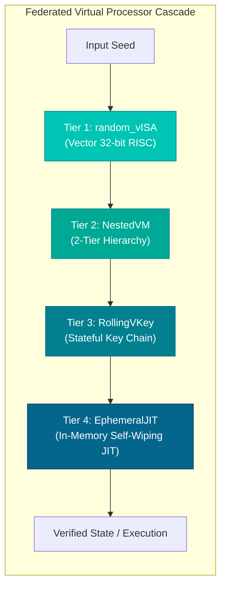

<div align="center">

# 💎 Vectis

### Advanced C Source Obfuscator & Multi-VCPU Federated Virtualization Engine

[](https://ocaml.org/)
[](https://github.com/goblint/cil)
[](https://github.com/rems-project/sail)
[](https://clang.llvm.org/)
[](LICENSE)

<p align="center">
  <b>Vectis</b> transforms standard C code into resilient, mathematically obfuscated C11 source code backed by per-build synthesized <b>Multi-Tier Virtual Processors (VCPUs)</b>, <b>E-Graph Equality MBA</b>, and <b>61+ military-grade protection passes</b>.
</p>

---

</div>

## 🌊 Core Features

* 🔮 **Federated 4-Tier VCPU Cascade**: Vector `random_vISA`, 2-tier `NestedVM`, stateful `RollingVKey`, and in-memory `EphemeralJIT`.
* 🧠 **Apple MLX Neural Engine**: PPO RL agent on Metal GPU for real-time MBA synthesis + 3-Level Z3 SMT formal verification.
* 🧬 **Multi-ISA per-Function Routing**: Compile different C functions into completely distinct, randomized virtual processor architectures within the same binary.
* 🌌 **E-Graph MBA Expansion**: Infinite non-linear bitwise identities generated via e-graph equality saturation (*arXiv:2603.03624*).
* 🛡️ **Anti-Decompiler Hardening**: Overlapping aliased register matrix (`__vbank`), Loki algebraic invariants (*arXiv:2106.08913*), VPC path constraints (*arXiv:2603.18355*), and ABI EH shadowing (*arXiv:2601.10261*).
* ⚡ **Drop-in Compiler Toolchain**: Seamless `vectis-cc` compiler wrapper for transparent integration with `make`, `cmake`, and `ninja`.

---

## 📚 Documentation Index

| Document | Topic & Focus |
| :--- | :--- |
| 🧠 **[MLX Neural Engine & AI](docs/mlx-ai-neural-subsystem.md)** | Apple Silicon MLX models, PPO synthesis, dataset gen, Z3 SMT verifier |
| 🏛️ **[Architecture](docs/architecture.md)** | Hexagonal layer design, Entities, Ports (SPI), Domain Services |
| 🛡️ **[4-VCPU Virtualization](docs/4-vcpu-federated-virtualization.md)** | 4-Tier VCPU cascade, formal Sail specifications, keygen solver |
| 🧬 **[ISA Pipeline](docs/isa-generation-pipeline.md)** | End-to-end guide: Sail/JSON synthesis to target C11 runtime |
| 🔑 **[License Keygen](docs/license-keygen.md)** | Meet-in-the-middle solver, cascade math, Python & C keygen tools |
| 🌀 **[Virtualization & vISA](docs/virtualization-and-random-visa.md)** | Synthetic vector ISA, nested VM, self-modifying bytecode, JIT |
| ⚡ **[Obfuscation Passes](docs/obfuscation-passes.md)** | Complete theoretical and mathematical reference for all 61+ passes |
| 🔄 **[Two-Level JIT & Signals](docs/two-tier-jit.md)** | Staging engine, Apple Silicon W^X cache, `ucontext_t` PC redirection |
| 🛠️ **[Compiler Wrapper](docs/compiler-wrapper.md)** | `vectis-cc` integration for CMake, Makefiles, and build scripts |
| 📋 **[CIL Capabilities](docs/cil-capabilities.md)** | Checkbox roadmap of all implemented features via Goblint-CIL |

---

## 🏗️ 4-Tier Virtual Processor Hierarchy



| Tier | Engine | Granular Annotation | Output Specification |
| :---: | :--- | :--- | :--- |
| **1** | `random_vISA` | `__attribute__((annotate("vectis:visa:ArchName")))` | [`vcpu1_visa.sail`](examples/optimal_license_sail/vcpu1_visa.sail) |
| **2** | `nested_vm` | `__attribute__((annotate("vectis:nested_vm")))` | [`vcpu2_nested_vm.sail`](examples/optimal_license_sail/vcpu2_nested_vm.sail) |
| **3** | `rolling_vkey` | `__attribute__((annotate("vectis:rolling_vkey")))` | [`vcpu3_rolling_vkey.sail`](examples/optimal_license_sail/vcpu3_rolling_vkey.sail) |
| **4** | `ephemeral_jit` | `__attribute__((annotate("vectis:ephemeral")))` | [`vcpu4_ephemeral_jit.sail`](examples/optimal_license_sail/vcpu4_ephemeral_jit.sail) |

---

## ⚡ Key Capabilities at a Glance

| Category | Highlights | Key Passes |
| :--- | :--- | :--- |
| **Virtualization** | Custom per-build ISAs, direct-threading computed gotos, S-box traps | `Virtualize`, `NestedVM`, `RollingVKey`, `SelfModVM`, `DecentDisp` |
| **Control Flow** | Irreducible CFG loops, Diophantine predicates, basic block jittering | `CFF`, `IrreducibleCFG`, `BCF`, `BBSplit`, `LoopToRecursion`, `IndirectJump` |
| **Data & Math** | High-order non-linear polynomial MBA, fixed-scale float MBA, variable splitting | `EGraphMBA`, `PolynomialMBA`, `FloatMBA`, `EncodeData`, `LUT`, `Homomorphic` |
| **Anti-Analysis** | Memory aliasing to defeat VTIL/NoVmp, ABI exception shadowing, anti-debug | `AntiVTIL`, `EHShadow`, `LokiInvariants`, `AntiDebug`, `TimingCheck`, `APIHash` |

---

## 🚀 Quick Start

### 1. Build the Toolchain
```bash
eval $(opam env)
dune build
```

### 2. Synthesize Custom Multi-ISA Specifications
```bash
# Generate specs for 4-VCPU architecture
vectis-synth --vcpu all --output-dir specs/
```

### 3. Obfuscate C Source Code
```bash
vectis -i target.c -o target.obf.c \
  --visa-specs-dir specs/ \
  --virtualize \
  --egraph-mba \
  --loki-invariants \
  --anti-vtil
```

### 4. Compile with Clang / GCC
```bash
clang -O2 target.obf.c -o app.bin
./app.bin
```

---

## 🛠️ Transparent Compiler Wrapper (`vectis-cc`)

Use `vectis-cc` as a drop-in replacement for `gcc` or `clang` in existing build systems:

```bash
export CC=vectis-cc
export CFLAGS="--vectis-virtualize --vectis-egraph-mba --vectis-anti-vtil"
make
```

---

<div align="center">

<sub>Engineered with 💎 by the Vectis Team. Licensed under the <a href="LICENSE">MIT License</a>.</sub>

</div>
