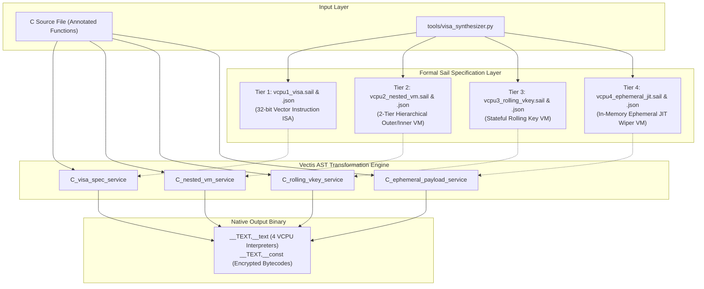

# 🛡️ 4-VCPU Federated Virtualization Architecture & Sail ISA Pipeline

## 📖 Overview

**Vectis** features a **4-Tier Cascading Virtualization Pipeline (Multi-VCPU)** combined with **Formal Sail Architecture Synthesis**. 

Rather than relying on a single monolithic virtual machine with fixed opcodes, Vectis synthesizes **unique, per-build hardware-level specifications** defined in formal **Sail DSL** (`.sail`) and structured JSON (`.json`), compiling CIL AST code into encrypted, heterogeneous bytecode streams executed by distinct virtual processor engines.

---

## 🏛 4-Tier Federated VCPU Architecture



---

## ⚙️ The 4 VCPU Tiers in Detail

### 1️⃣ Tier 1 (VCPU 1): `random_vISA` (Vector Processor)
* **Annotation**: `__attribute__((annotate("vectis:visa")))`
* **Formal Sail Spec**: [`examples/vcpu1_visa.sail`](file:///Volumes/External/Code/vectis/examples/vcpu1_visa.sail)
* **Characteristics**:
  - Full 32-bit Vector Instruction Word architecture (`funct6[31:26] | vm[25] | vs2[24:20] | vs1[19:15] | funct3[14:12] | vd[11:7] | opcode[6:0]`).
  - 64 virtual vector registers (`__vregs[64]`).
  - 14-bit immediate packing (`vli.vi`), conditional branch comparisons (`vbge.vv`), memory vector loading (`vle8.v`), and pointer arithmetic.
  - Per-instruction rolling XOR decryption: $\text{Key}_{pc} = \text{PackKey} \oplus (pc \times \Delta_{\text{key}})$.

### 2️⃣ Tier 2 (VCPU 2): `nested_vm` (2-Tier Hierarchical VM)
* **Annotation**: `__attribute__((annotate("vectis:nested_vm")))`
* **Formal Sail Spec**: [`examples/vcpu2_nested_vm.sail`](file:///Volumes/External/Code/vectis/examples/vcpu2_nested_vm.sail)
* **Characteristics**:
  - Interpreter-in-Interpreter design:
    - **Outer Meta-Controller**: Decrypts outer bytecode managing frame setup (`OUT_SETUP`), dispatching (`OUT_DISPATCH`), key rotation (`OUT_MUTATE_KEY`), and termination (`OUT_HALT`).
    - **Inner Worker VCPU**: Decrypts arithmetic/register operations (`IN_ADD`, `IN_SUB`, `IN_MUL`, `IN_XOR`, `IN_LOAD_ARG`, `IN_LOAD_CONST`, `IN_RET`) on 8 virtual registers.
  - Independent rolling algebraic keys for outer and inner bytecode layers.

### 3️⃣ Tier 3 (VCPU 3): `rolling_vkey` (Stateful Rolling Key VM)
* **Annotation**: `__attribute__((annotate("vectis:rolling_vkey")))`
* **Formal Sail Spec**: [`examples/vcpu3_rolling_vkey.sail`](file:///Volumes/External/Code/vectis/examples/vcpu3_rolling_vkey.sail)
* **Characteristics**:
  - Cryptographic state synchronization tied strictly to execution history:
    $$VKey_{n+1} = (VKey_n \times 33) \oplus (Dec_n + \text{0x9E3779B9})$$
  - Out-of-order execution, isolated opcode tracing, or memory byte patching causes immediate desynchronization of all subsequent instruction decryptions.

### 4️⃣ Tier 4 (VCPU 4): `ephemeral_jit` (In-Memory JIT Wiper VM)
* **Annotation**: `__attribute__((annotate("vectis:ephemeral")))`
* **Formal Sail Spec**: [`examples/vcpu4_ephemeral_jit.sail`](file:///Volumes/External/Code/vectis/examples/vcpu4_ephemeral_jit.sail)
* **Characteristics**:
  - Allocated dynamically into anonymous RAM pages via `mmap(PROT_READ | PROT_WRITE)`.
  - Bytecode payload is decrypted directly in RAM, executed, and **immediately zeroed (`memset 0`) and unmapped (`munmap`)**.
  - Prevents RAM memory dumping and core dump reconstruction of validation logic.

---

## 🔑 License Keygen Mathematics & Verification

In Example 01 ([`examples/01_license_keygen.c`](file:///Volumes/External/Code/vectis/examples/01_license_keygen.c)), a 16-character license key string is cascaded through all 4 VCPUs:

$$
\begin{aligned}
h_1 &= \text{VCPU}_1(\text{key}) = 12687 \\
h_2 &= \text{VCPU}_2(h_1) = h_1 + 21 = 12708 \\
h_3 &= \text{VCPU}_3(h_2) = ((h_2 + 10) \oplus 42) \times 2 = 25352 \\
\text{is\_valid} &= \text{VCPU}_4(h_3) = (h_3 == 25352) \implies 1\ (\text{UNLOCKED})
\end{aligned}
$$

### Keygen Tools:
- **Python Keygen Tool ([`tools/license_keygen.py`](file:///Volumes/External/Code/vectis/tools/license_keygen.py))**:
  ```bash
  python3 tools/license_keygen.py -n 5 --prefix PRO- --verify
  ```
- **Native C Keygen Tool ([`examples/01_keygen_tool.c`](file:///Volumes/External/Code/vectis/examples/01_keygen_tool.c))**:
  ```bash
  ./examples/01_keygen_tool.bin 5 "ULT-"
  ```

---

## 🚀 Building and Running the 4-VCPU Demo

Execute the automated build pipeline script:
```bash
./scripts/build_license_demo.sh
```

This script:
1. Synthesizes all 4 Formal Sail and JSON specifications via `tools/visa_synthesizer.py`.
2. Compiles `01_license_keygen.c` through Vectis with 4-VCPU virtualization + CFF + Irreducible CFG loops + Anti-Debug + Timing Verification + API Hashing + Symbol Renaming.
3. Compiles the native AArch64 executable `01_license_keygen_virtualized.bin`.
4. Runs automated validation test vectors with valid, tampered, and default keys.
