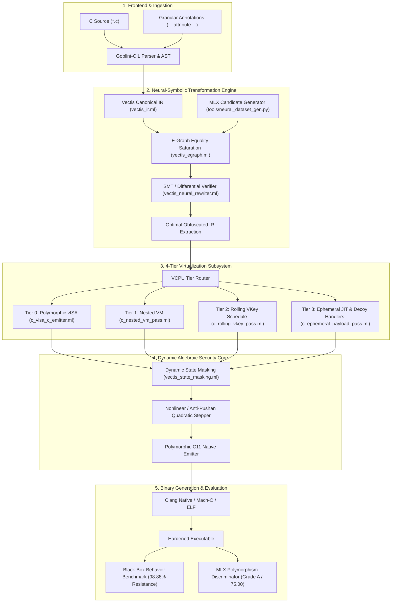

# 🏛️ Vectis Next: System Architecture

**Vectis Next** is an advanced neuro-symbolic compiler, 4-tier virtual machine ecosystem, and binary hardening pipeline built in **OCaml 5**, **CIL / Goblint-CIL**, and **Apple MLX / Z3**.

---

## 🧩 Architectural Diagram

---

## 🏢 Hexagonal Architecture & Module Boundaries

Vectis strictly follows **Domain-Driven Design (DDD)** and **Hexagonal Architecture**:

| Layer | Path | Responsibility |
|---|---|---|
| **Domain** | `lib/domain/` | Pure entities & services (`vectis_ir.ml`, `vectis_isa.ml`, `vectis_egraph.ml`, `vectis_state_masking.ml`, `vectis_neural_rewriter.ml`, `vectis_vm_interpreter.ml`). Zero I/O dependencies. |
| **Usecases** | `lib/usecases/` | Obfuscation pipelines, CIL pass composition, JIT runners, Sail synthesis dispatchers. |
| **Adapters** | `lib/adapters/` | Goblint-CIL bindings, Clang process wrappers, Posix mmap / MAP_JIT allocators, system entropy. |
| **Ports** | `lib/ports/` | Abstract signatures (`entropy_port.ml`, `encoder_port.ml`, `vm_port.ml`, `cil_port.ml`). |
| **Drivers** | `bin/`, `tools/` | CLI tools (`vectis_cli.py`, `main.exe`, `vectis_cc.exe`, `blackbox_behavior_benchmark.py`). |

---

## 🔒 4-Tier Virtual Machine Cascade

1. **Tier 0: Polymorphic vISA (`random_vISA`)**:
   Dynamic 32/64-register virtual architecture with randomized opcodes, randomized C variable identifiers, and mixed-boolean-arithmetic (MBA) ALU handlers.
2. **Tier 1: Nested VM (`nested_vm`)**:
   Two-tier interpreter hierarchy where an outer meta-VM decodes and dispatches bytecodes executing an inner worker VM.
3. **Tier 2: Rolling VKey Schedule (`rolling_vkey`)**:
   Dynamic runtime key evolution where instruction decoding depends on the current program counter, epoch counter, and live register state:
   $$K(pc, state, epoch) = \big((pc \times 0x9E3779B9) \oplus (state \times 0x517CC1B7)\big) \times 0x63C63CD9 + epoch$$
4. **Tier 3: Ephemeral JIT (`ephemeral_jit`)**:
   Bytecode handlers compiled just-in-time into randomized memory pages and sanitized immediately after single execution following DoD 5220.22-M wipe standards.
