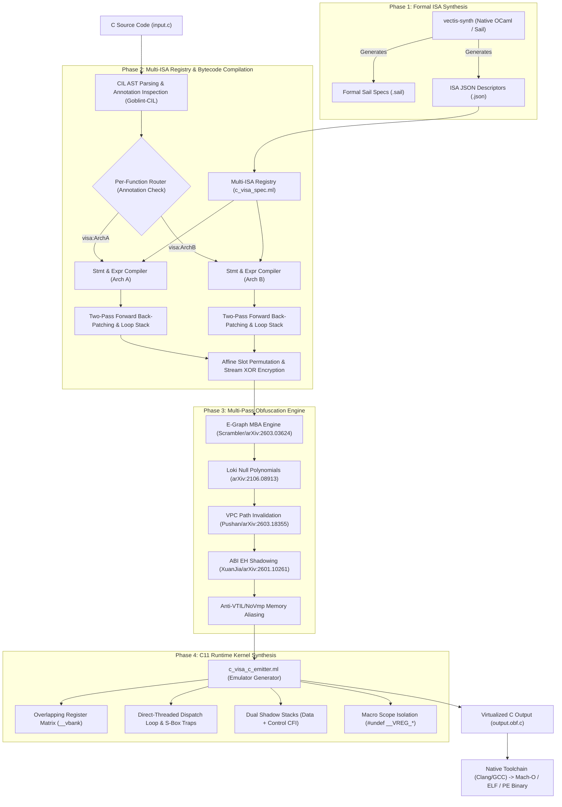

# 🧬 Architecture: End-to-End ISA Synthesis & C Virtualization Pipeline

This document details the architectural pipeline of **Vectis** for synthesizing custom formal Instruction Set Architectures (ISAs), compiling high-level C code into packed bytecode, and generating self-contained, virtualized C11 runtimes and native binaries.

---

## 📐 1. Pipeline Architecture Overview



---

## ⚙️ 2. Phase 1: Formal ISA & Specification Synthesis

Every compilation pass can synthesize a unique, randomized instruction set architecture using the native tool `vectis-synth` or `c_isa_synthesizer_service.ml`.

### 2.1 32-Bit Instruction Word Layout & 24 Permutation Space
Each instruction word is encoded dynamically at build time into one of **$4! = 24$ valid bitfield arrangements** over the free window `[25:7]`:

$$\text{Word} = \mathcal{E}(\mathrm{funct6}_{[31:26]}, \mathrm{vm}, \mathrm{vs2}, \mathrm{vs1}, \mathrm{funct3} + \mathrm{vd}, \mathrm{opcode}_{[6:0]})$$

| Field Block | Width | Invariants & Constraints |
| :--- | :--- | :--- |
| `funct6` | 6 bits | Fixed at `[31:26]` (Primary Opcode Selector, mask `0x3F`) |
| `pair` (`funct3` + `vd`) | 8 bits | Fused branch target / destination pair (`funct3_shift = vd_shift + 5`, `vd_shift` $\in \{7, 8, 12, 13, 17, 18\}$) |
| `vm` | 1 bit | Vector/Register Mask Mode bit (`[25:7]` window) |
| `vs2` | 5 bits | Second Source Virtual Register ($r_0 \dots r_{31}$) |
| `vs1` | 5 bits | First Source Virtual Register ($r_0 \dots r_{31}$) |
| `opcode` | 7 bits | Fixed at `[6:0]` (Base Opcode Marker, 128 variants mod 128) |

> [!NOTE]
> For unconditional jumps (`vj`), because there are no register operands (`vs1`/`vs2`), the target field occupies the entire **19-bit window** `[25:7]` (mask `0x7FFFF`, bottom fixed at shift 7), allowing jumps across up to 524,288 instructions. All layouts are verified via `validate_layout` before emission.

### 2.2 Formal Sail Specification (`.sail`)
Generates formal ISA models executable and verifiable with Cambridge Sail:
```sail
val execute : visa_instruction -> unit
function execute(inst) = {
  match inst {
    VADD(vd, vs1, vs2) => {
      let a = read_vreg(vs1);
      let b = read_vreg(vs2);
      write_vreg(vd, (a ^ b) + ((a & b) << 1)); /* Non-linear MBA */
    },
    VBGE(vs1, vs2, target) => {
      if read_vreg(vs1) >= read_vreg(vs2) then set_pc(target);
    },
    VRET() => {
      verify_cfi_canary();
      exit_vcpu();
    }
  }
}
```

### 2.3 JSON ISA Descriptor (`.json`)
The JSON descriptor provides machine-readable parameters ingested by `c_visa_spec.ml`:
```json
{
  "isa_name": "VCPU1_Arch",
  "isa_version": "1.0",
  "word_bits": 32,
  "reg_count": 16,
  "pack_key": "0x5A5AA5A5",
  "delta_key": "0x1000193",
  "layout": {
    "funct6_shift": 26, "funct6_mask": 63,
    "vm_shift": 25, "vs2_shift": 20, "vs1_shift": 15,
    "funct3_shift": 12, "vd_shift": 7, "opcode_val": 87
  },
  "opcodes": {
    "vadd_vv": 45, "vsub_vv": 60, "vmul_vv": 31, "vxor_vv": 44,
    "vli_vi": 1, "vbge_vv": 36, "vj": 19, "vret_v": 13
  },
  "abi": {
    "in_regs": [7, 3, 2, 1],
    "out_reg": 0
  }
}
```

---

## 🔄 3. Phase 2: Bytecode Compilation & Control Flow Resolution

The AST compiler is structured into modular domain services:

```
lib/domain/services/c_source/virtualization/
├── c_visa_spec.ml           # Multi-ISA Registry & JSON Specification Ingestion
├── c_visa_expr_compiler.ml   # Multi-Word Constants, Normalizers & Micro-Op MBA (175 lines)
├── c_visa_stmt_compiler.ml   # Two-Pass Forward Back-Patching & Loop Break Stack (199 lines)
├── c_visa_c_emitter.ml       # C11 Direct-Threaded Kernel & Macro Isolation (389 lines)
└── c_visa_spec_service.ml    # Per-Function ISA Router & Dispatch Orchestrator (217 lines)
```

### 3.1 Multi-Word Constant Loading
Immediate fields in 32-bit vISA instructions support 14-bit literals (`0x3FFF = 16383`). For values $> 16383$ (up to $2^{32}-1$), `c_visa_expr_compiler.ml` generates multi-word shift-and-OR sequences:
```
lo   = val & 0x3FFF
mid  = (val >> 14) & 0x3FFF
vli_vi  dst, lo
vli_vi  tmp, mid
vsll_vv tmp, 14
vor_vv  dst, tmp
```

### 3.2 Comparison Normalization via Sign-Bit Extraction
Comparison operators (`<`, `<=`, `>`, `>=`, `==`, `!=`) and logical not (`!`) are lowered to normalized $0$ or $1$ boolean values using non-linear arithmetic and sign-bit extraction:
* **Less-Than ($a < b$)**: $(a - b) \gg 63$ (extracts the 64-bit sign bit).
* **Equality ($a == b$)**: $(a \oplus b)$, normalized via $\text{dst} = (\text{dst} \mid (-\text{dst})) \gg 63 \oplus 1$.

### 3.3 Two-Pass Forward Back-Patching & Loop Stack
To handle forward references in `if/else` branching and nested loop exits (`break` / `continue`):
1. **Instruction Buffer (`patch_buf`)**: Emits temporary placeholder instructions with target $= 0$.
2. **Loop Stack (`loop_stack`)**: Pushes loop context on entry. When compiling `break`, an unconditional jump is emitted and registered in `ctx.break_indices`.
3. **Back-Patching**: Once the branch or loop block length is determined, target addresses are patched in-place before bytecode slot permutation.

### 3.4 Affine Permutation & Synchronized Stream Encryption
Bytecode words are permuted using an affine bijection and encrypted using 32-bit linear feedback counter mode:
$$\text{slot}(pc) = ((pc \times P) + S) \pmod N \quad \text{where } \gcd(P, N) = 1$$
$$\text{Enc}(inst, pc) = inst \oplus (K_{\text{pack}} \oplus (pc \times K_{\Delta}))$$

---

## 🔀 4. Multi-ISA Architecture: Per-Function Virtualization Routing

Vectis supports virtualizing different functions within the same compilation unit into **completely different, independent ISAs**.

### 4.1 Granular Function Annotations
```c
// Compiles to ISA: VCPU1_Arch (Opcode layout A, Key A, S-Box A)
__attribute__((annotate("vectis:visa:VCPU1_Arch")))
int calculate_hash(int a, int b) {
    return (a * 3) + (b ^ 7);
}

// Compiles to ISA: VCPU2_Arch (Opcode layout B, Key B, S-Box B)
__attribute__((annotate("vectis:visa:VCPU2_Arch")))
int verify_signature(int x, int y) {
    return (x - 5) * (y + 2);
}
```

### 4.2 Multi-ISA CLI Loading
Load an entire folder of synthesized specifications or specify multiple `--visa-spec` flags:
```bash
# Load all specs from directory
vectis -i input.c -o output.obf.c \
  --visa-specs-dir specs/ \
  --virtualize

# Or specify individual specs
vectis -i input.c -o output.obf.c \
  --visa-spec specs/VCPU1_Arch.json \
  --visa-spec specs/VCPU2_Arch.json \
  --virtualize
```

### 4.3 Automatic Per-Function Fragmentation (active by default)

Explicit `visa:NAME` annotations are optional. When the loaded pool holds
more than one spec, **every function without an explicit name is bound to
its own ISA via a stable hash of its name** (`C_visa_spec.get_fragmented_spec`).
`make virtualize` / `make obfuscate` load the whole pool via
`--visa-specs-dir examples/ml_optimized`, where `make ml-specs` synthesizes a
fresh fragmentation pool (`visa_f0..N.json`, unique seeds/opcode tables/layouts
per fragment) on every build.

Security effect (measured, N=20 × 3 builds): recovering one opcode table
(~130 secret bits) no longer transfers to any other function — the attacker
pays per function, not per binary. Cross-release 3-gram similarity median
drops from ~87% to ~79% and the identical-build tail (max pair similarity
100%) is eliminated.

### 4.4 Macro Scope Isolation (`#undef`)

To prevent macro redefinition warnings when multiple VCPU emulators are synthesized in a single `.c` file, `c_visa_c_emitter.ml` automatically emits clean-up directives:
```c
    return (int)__res_val;
}
#undef __VREG_ROT
#undef __VREG_MASK
#undef __VREG_GET
#undef __VREG_SET
#undef __VISA_DISPATCH
```

---

## 🛡️ 5. Phase 3 & 4: C11 Runtime Kernel & Defense Injections

`c_visa_c_emitter.ml` synthesizes the self-contained C11 execution kernel with active defense layers:

### 5.1 Anti-VTIL & Anti-NoVmp Overlapping Memory Bank
Registers are hosted in a 1024-byte overlapping union to defeat static SSA register promotion in tools like VTIL and NoVmp:
```c
union __attribute__((aligned(16))) {
    unsigned char      __b[1024];
    unsigned long long __q[128];
} __vbank;

#define __VREG_ROT(r) (((unsigned int)(r) + 37U) & 0x3FU)
#define __VREG_MASK(r) (0x32d6396be17dULL + ((unsigned long long)__VREG_ROT(r) * 0x517cc1b727220a95ULL))
#define __VREG_GET(r)  (__vbank.__q[__VREG_ROT(r)] ^ __VREG_MASK(r))
#define __VREG_SET(r, val) do { __vbank.__q[__VREG_ROT(r)] = ((unsigned long long)(val)) ^ __VREG_MASK(r); } while(0)
```

### 5.2 VPC-Sensitive Path Constraint Invalidation (Anti-Pushan)
Branch targets in `vbge` and `vj` are computed through quadratic Galois invariants over a rolling path accumulator:
```c
/* Rolling Path Hash Accumulator */
__vm_state_acc = ((__vm_state_acc * 0x63c63cd93839c9b9ULL) ^ (__vd + __funct6 + (unsigned long long)__pc)) * 0x517CC1B727220A95ULL;

/* Anti-Symbolic Jump Target: P(acc) = (acc * (acc + 1)) mod 2 == 0 */
__pc = (unsigned int)((__branch_target) + ((__vm_state_acc * (__vm_state_acc + 1ULL)) & 1ULL));
```

### 5.3 Direct-Threading Dispatch Loop & Synthetic S-Box Traps
Execution uses computed goto labels without a central `switch(op)`:
```c
static const void * const __dispatch_table[64] = {
    [0 ... 63] = &&__h_default,
    [0x2D] = &&__h_vadd,
    [0x3C] = &&__h_vsub,
    [0x1F] = &&__h_vmul,
    [0x24] = &&__h_vbge,
    [0x13] = &&__h_vj,
    /* 48+ synthetic S-box trap handlers */
};

#define __VISA_DISPATCH() do { \
    if (__pc >= 8) goto __h_vret; \
    unsigned int __slot = ((__pc * 3U) + 3U) % 8U; \
    __raw = __vbc_live[__slot]; \
    __key = 0x9812edfdU ^ (__pc * 0x1000193U); \
    __inst = __raw ^ __key; \
    __funct6 = (unsigned char)((__inst >> 26) & 0x3F); \
    __pc++; \
    goto *__dispatch_table[__funct6 & 0x3F]; \
} while (0)
```

### 5.4 Dual Shadow Stacks & CFI Validation
* **Data Shadow Stack (`__vstack_data[64]`)**: Holds temporary spilled variables and intermediate computations.
* **Control Shadow Stack (`__vstack_ctrl[32]`)**: Stores dynamic CFI canaries XOR-ed with function pointer origins and bytecode hash entropy.

---

## 🚀 6. Quick Start & Verification

### 1. Synthesize ISAs with ML Overrides and Seed Control
```bash
# Synthesize with fresh crypto-random entropy (unique architecture per build)
vectis-synth --vcpu all --output-dir specs/

# Synthesize with ML parameter overrides (GF poly, ROL constant, imm width)
vectis-synth --vcpu visa --name VCPU1_Arch --gf-poly 0x8D --rol-const 5 --imm-bits 16 --output-dir specs/

# Synthesize with deterministic seed for reproducible CI/CD
vectis-synth --vcpu visa --name VCPU1_Arch --seed 42 --output-json specs/VCPU1_Arch.json
```

### 2. Full 4-Tier Virtualization in One Command
```bash
# Automatically builds, generates fresh ML specs, and compiles with Clang -O2
make virtualize IN=examples/09_test_multi_isa.c BIN=test_multi.bin
./test_multi.bin
```

### 3. Manual Granular CLI Compilation
```bash
vectis -i examples/09_test_multi_isa.c -o examples/09_test_multi_isa_virtualized.c \
  --visa-specs-dir specs/ \
  --virtualize \
  --rolling-vkey \
  --anti-vtil \
  --loki-invariants

clang -w -O2 examples/09_test_multi_isa_virtualized.c -o test_multi.bin
./test_multi.bin
```
