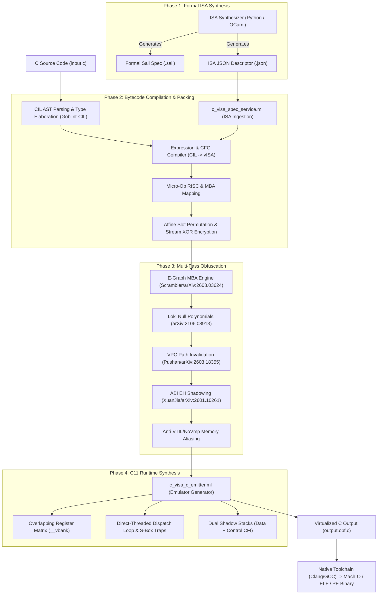

# 🧬 Architecture: End-to-End ISA Synthesis & C Virtualization Pipeline

This document details the architectural pipeline of **OcaSorry** for synthesizing custom formal Instruction Set Architectures (ISAs) and compiling high-level C code into self-contained, virtualized C11 source and native binaries.

---

## 📐 1. Pipeline Architecture Overview



---

## ⚙️ 2. Phase 1: Formal ISA & Specification Synthesis

The ISA is completely randomized per compilation. The formal specification is generated by `tools/visa_synthesizer.py` and `c_isa_synthesizer_service.ml`.

### 2.1 32-Bit Instruction Word Layout
Each instruction word is encoded into a randomized bitfield layout:

$$\text{Word} = \mathcal{E}(\text{funct6}, \text{vm}, \text{vs2}, \text{vs1\_imm}, \text{funct3}, \text{vd})$$

| Field | Width | Description |
| :--- | :--- | :--- |
| `funct6` | 6 bits | Primary Opcode Selector ($0 \le \text{slot} \le 63$) |
| `vm` | 1 bit | Vector/Register Mask Mode |
| `vs2` | 5 bits | Second Source Virtual Register ($r_0 \dots r_{31}$) |
| `vs1_imm` | 5 bits | First Source Virtual Register or 5-bit Immediate |
| `funct3` | 3 bits | Sub-operation Selector / Width modifier |
| `vd` | 5 bits | Destination Virtual Register ($r_0 \dots r_{31}$) |

### 2.2 Formal Sail Specification (`.sail`)
Generates formal ISA models executable and verifiable with the Cambridge Sail verification tool:
```sail
val execute : visa_instruction -> unit
function execute(inst) = {
  match inst {
    VADD(vd, vs1, vs2) => {
      let a = read_vreg(vs1);
      let b = read_vreg(vs2);
      write_vreg(vd, (a ^ b) + ((a & b) << 1)); /* Non-linear MBA */
    },
    VRET() => {
      verify_cfi_canary();
      exit_vcpu();
    }
  }
}
```

### 2.3 JSON ISA Descriptor (`.json`)
The JSON file defines machine-readable parameters ingested by `c_visa_spec.ml`:
```json
{
  "isa_name": "MachO_EGraph_4VCPU_Arch",
  "word_size": 32,
  "opcodes": {
    "vadd": "0x14", "vadd_alt1": "0x28", "vadd_alt2": "0x0A",
    "vsub": "0x07", "vxor": "0x3F", "vli": "0x1A", "vbge": "0x1F"
  },
  "packing": { "affine_p": 37, "affine_s": 19, "pack_key": "0xDEADBEEFCAFE" }
}
```

---

## 🔄 3. Phase 2: CIL AST to vISA Bytecode Compilation

`c_visa_spec_service.ml` recursively walks the Goblint-CIL Abstract Syntax Tree:

1. **Expressions (`exp`)**:
   * Arithmetic binary operations (`+`, `-`, `*`, `^`, `&`, `|`) are lowered into multi-alias polymorphic RISC micro-ops.
   * Negations (`-x`, `~x`) are expanded via MBA identities (`vxor`, `vsub`).
   * Pointers (`*ptr`, `arr[i]`) are lowered into indexed memory fetches (`vle8`).
2. **Control Flow (`stmt`)**:
   * `if (cond) { ... } else { ... }` generates conditional compare-and-branch micro-ops (`vbge`, `vbeq`).
   * Loop constructs (`while`, `for`, `do-while`) are flattened into indirect computed gotos (`vj`).
3. **Bytecode Stream Encryption & Slot Permutation**:
   * Opcodes are not placed contiguously in memory. They are permuted using an affine bijection:
     $$\text{slot}(pc) = ((pc \times P) + S) \pmod N$$
   * Each word is XOR-encrypted with a dynamic counter-mode key:
     $$\text{Enc}(inst, pc) = inst \oplus (\text{pack\_key} \oplus (pc \times \text{delta\_key}))$$

---

## 🛡️ 4. Phase 3 & 4: C11 Runtime Synthesis & Defense Injections

`c_visa_c_emitter.ml` synthesizes the self-contained C11 execution kernel:

### 4.1 Anti-VTIL & Anti-NoVmp Overlapping Memory Bank
Instead of isolated variables, registers are hosted in a multi-type overlapping union to defeat static SSA register promotion:
```c
union __attribute__((aligned(16))) {
    unsigned char      __b[1024];
    unsigned long long __q[64];
} __vbank;

#define __VREG_ROT(r) (((unsigned int)(r) + 42U) & 0x3FU)
#define __VREG_MASK(r) (0x9E3779B9ULL + ((unsigned long long)__VREG_ROT(r) * 0x517CC1B7ULL))
#define __VREG_GET(r)  (__vbank.__q[__VREG_ROT(r)] ^ __VREG_MASK(r))
#define __VREG_SET(r, val) do { __vbank.__q[__VREG_ROT(r)] = ((unsigned long long)(val)) ^ __VREG_MASK(r); } while(0)
```

### 4.2 VPC-Sensitive Path Constraint Invalidation (Anti-Pushan)
Branch targets in `vbge` and `vj` are computed through quadratic Galois invariants over a rolling path accumulator:
```c
/* Rolling Path Hash Accumulator */
__vm_state_acc = ((__vm_state_acc * 0x63c63cd93839c9b9ULL) ^ (__vd + __funct6 + (unsigned long long)__pc)) * 0x517CC1B727220A95ULL;

/* Anti-Symbolic Jump Target: P(acc) = (acc * (acc + 1)) mod 2 == 0 */
__pc = (unsigned int)((target_pc) + ((__vm_state_acc * (__vm_state_acc + 1ULL)) & 1ULL));
```

### 4.3 Direct-Threading Dispatch Loop & Synthetic S-Box Traps
Execution uses computed goto labels without a central `switch(op)`:
```c
static const void * const __dispatch_table[64] = {
    [0 ... 63] = &&__h_default,
    [0x14] = &&__h_vadd,
    [0x28] = &&__h_vadd_alt1,
    [0x07] = &&__h_vsub,
    [0x1F] = &&__h_vbge,
    [0x3F] = &&__h_vxor,
    /* 58+ synthetic S-box trap handlers */
};

#define __VISA_DISPATCH() do { \
    if (__pc >= WORD_COUNT) goto __h_vret; \
    unsigned int __slot = ((__pc * 37U) + 19U) % WORD_COUNT; \
    __raw = __vbc_live[__slot]; \
    __inst = __raw ^ (0xDEADBEEFULL ^ (__pc * 0xCAFEBEEFULL)); \
    __funct6 = (unsigned char)((__inst >> 26) & 0x3F); \
    __pc++; \
    goto *__dispatch_table[__funct6]; \
} while(0)
```

### 4.4 Dual Shadow Stacks & CFI Validation
* **Data Shadow Stack (`__vstack_data[64]`)**: Holds temporary spilled variables and intermediate computations.
* **Control Shadow Stack (`__vstack_ctrl[32]`)**: Stores dynamic CFI canaries XOR-ed with function pointer origins and entropy seeds.

---

## 🚀 5. Quick Verification

To synthesize a complete 4-VCPU architecture and compile to a native Mach-O executable:

```bash
# 1. Synthesize Sail & JSON Specs
python3 tools/visa_synthesizer.py --output-dir examples/optimal_license_sail/ --name MachO_4VCPU --vcpu all

# 2. Virtualize and Obfuscate C Code
ocasorry -i input.c -o output.obf.c \
  --visa-spec examples/optimal_license_sail/vcpu1_visa.json \
  --egraph-mba \
  --loki-invariants \
  --anti-vtil \
  --eh-shadow \
  --virtualize \
  --nested-vm \
  --rolling-vkey

# 3. Compile to Native 64-Bit Binary
clang -O2 output.obf.c -o target.bin
```
