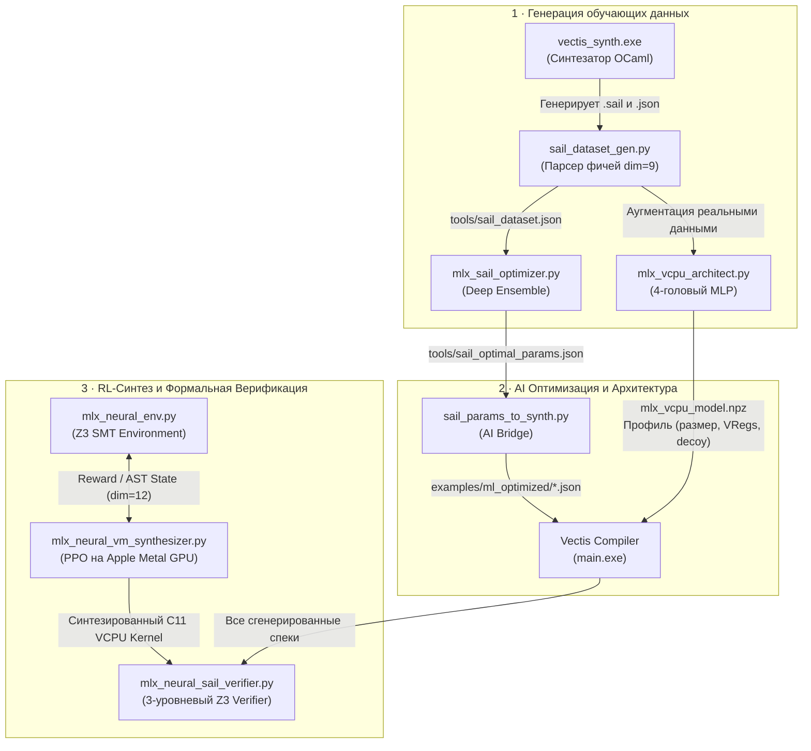

# 🧠 Vectis MLX Neural Engine & AI Subsystem

> **Руководство для начинающих**: как работают нейросети на Apple Silicon (MLX), генерация датасетов, PPO-синтез обфускаций и Z3-верификатор в Vectis.

---

## 🌟 Зачем нейросети в C-обфускаторе?

Обычные обфускаторы используют **статические правила** (шаблоны замен). Реверс-инженеры создают плагины к декомпиляторам (например, *D810* для IDA Pro или *Triton/Z3*), которые автоматически упрощают такие шаблоны обратно в исходный код.

**Vectis решает эту проблему через нейросети (Apple MLX на Metal GPU):**
1. **Генерирует уникальные ISA**: архитектура виртуального процессора меняется при каждой сборке.
2. **Ищет оптимальные параметры защиты**: нейросеть предсказывает GF-полиномы, энтропию мнемоник и глубину MBA.
3. **Обучает RL-агента (PPO)**: агент изобретает новые, нелинейные MBA-цепочки прямо во время синтеза.
4. **Формально доказывает эквивалентность через Z3 SMT (QFBV)**: ни одна трансформация не попадает в бинарник без 100% математического доказательства идентичности.

---

## 🗺️ Архитектура и поток данных



---

## 📦 Описание скриптов: что делает каждый файл

### 1. `tools/sail_dataset_gen.py` — Генератор датасета
* **Что делает**: Запускает `vectis_synth.exe` с сотнями разных сидов, извлекает 9 структурных признаков (GF-полином, энтропия мнемоник, плотность опкодов) и считает `quality_score` (0.0 .. 1.0).
* **Результат**: Создает файл `tools/sail_dataset.json`.
* **Запуск**:
  ```bash
  python3 tools/sail_dataset_gen.py -n 500 -o tools/sail_dataset.json
  ```

---

### 2. `tools/mlx_sail_optimizer.py` — Оптимизатор параметров ISA
* **Что делает**: Обучает ансамбль из 3–5 глубоких нейросетей (`SailQualityNet`) на Apple Silicon GPU. Использует градиентный подъем с пессимистической оценкой (UCB/LCB: $\mu - 1.5\sigma$) для поиска глобального оптимума криптостойкости ISA.
* **Результат**: Находит идеальные параметры для 4-х VCPU и сохраняет в `tools/sail_optimal_params.json`.
* **Запуск**:
  ```bash
  python3 tools/mlx_sail_optimizer.py --dataset tools/sail_dataset.json --vcpu all
  ```

---

### 3. `tools/mlx_vcpu_architect.py` — Дизайнер профилей VCPU
* **Что делает**: 4-головая нейросеть (`VCPUArchitectMLX`). Принимает желаемый размер бинарника (КБ), бюджет задержки (мкс) и уровень угрозы (1–4), а затем рассчитывает:
  1. Профиль защиты (`fortress-256k`, `colossus-1m`, и т.д.)
  2. Параметры виртуализации (число слотов диспетчера, decoy-ловушек, S-Box LUT)
  3. Оптимальное распределение функций по 4 тирам VCPU.
* **Запуск**:
  ```bash
  python3 tools/mlx_vcpu_architect.py --target-size 256 --threat 4
  ```

---

### 4. `tools/mlx_neural_env.py` — Формальная SMT-среда для RL
* **Что делает**: Математический бекенд для обучения с подкреплением. Управляет AST-деревом операций в Z3 BitVec(64) и строго валидирует каждый шаг:
  * `unsat` $\rightarrow$ Доказано эквивалентно (агент получает положительную награду).
  * `sat` $\rightarrow$ Найден контрпример/баг (штраф $-100$, эпизод завершается).
  * `unknown / timeout` $\rightarrow$ Не доказано (штраф $-50$, эпизод завершается).
  * `DECOY` $\rightarrow$ Без изменения AST (награда $0.0$, защита от накрутки).

---

### 5. `tools/mlx_neural_vm_synthesizer.py` — PPO RL-синтезатор MBA
* **Что делает**: Обучает Actor-Critic политику (PPO-Clip) на Metal GPU изобретать цепочки обфускации под конкретный VCPU tier (`visa`, `nested_vm`, `rolling_vkey`, `ephemeral_jit`).
* **Результат**: Генерирует C11-код обработчиков, компилирует его через `clang -O2` и проверяет на численных тест-векторах.
* **Запуск**:
  ```bash
  python3 tools/mlx_neural_vm_synthesizer.py --tier visa --episodes 40
  ```

---

### 6. `tools/mlx_neural_sail_verifier.py` — 3-Уровневый верификатор
* **Что делает**: Формально доказывает корректность всех сгенерированных `.json` спецификаций через Z3 QFBV:
  * **Level 1 (Decode Soundness)**: Все опкоды строго разделены (нет коллизий в 6-битном поле `funct6`).
  * **Level 2 (Execute Correctness)**: Семантика инструкций эквивалентна канонической (ALU, MBA, GF28).
  * **Level 3 (Key-Schedule Integrity)**: Инволюция ключей и обратимость раундов Feistel в `RollingVKey`.
* **Запуск**:
  ```bash
  python3 tools/mlx_neural_sail_verifier.py examples/
  ```

---

### 7. `tools/sail_params_to_synth.py` — Мост AI $\rightarrow$ Компилятор
* **Что делает**: Читает `sail_optimal_params.json` и преобразует оптимальные параметры в вызовы `vectis_synth.exe`, генерируя готовые `.json` и `.sail` спецификации в `examples/ml_optimized/`.
* **Запуск**:
  ```bash
  python3 tools/sail_params_to_synth.py --run
  ```

---

## ⚡ Быстрый старт (Make-команды)

Вам не нужно запускать каждый скрипт вручную. Все сценарии автоматизированы:

```bash
# 1. Запустить полный цикл переобучения AI и верификации:
make ml-pipeline

# 2. Сгенерировать свежие ML-спецификации:
make ml-specs

# 3. Формально верифицировать все спеки через Z3 SMT:
make ml-verify

# 4. Обфусцировать и скомпилировать программу с 4-уровневой виртуализацией:
make virtualize IN=my_app.c BIN=my_app_protected
```

---

## ❓ Часто задаваемые вопросы (FAQ)

<details>
<summary><b>Как убедиться, что нейросеть не сломает логику программы?</b></summary>
Каждое преобразование перед генерацией C-кода проходит через решатель Z3 SMT (теория <code>QF_BV</code>). Решатель проверяет утверждение: <code>оригинал != обфусцированное</code>. Если Z3 возвращает <code>unsat</code>, это означает строгое математическое доказательство того, что для всех 2⁶⁴ возможных входных значений результат совпадает на 100%.
</details>

<details>
<summary><b>Нужна ли видеокарта Nvidia или CUDA?</b></summary>
Нет! Скрипты написаны на <b>Apple MLX</b> и используют аппаратный стек <b>Apple Silicon Metal GPU (M1/M2/M3/M4)</b> с унифицированной памятью.
</details>
