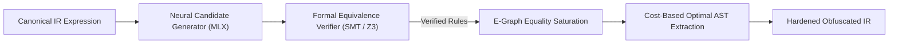

# 🧠 Vectis Neural-Symbolic Rewriter & E-Graph Engine

The **Vectis Neural-Symbolic Rewriter** combines neural AST candidate generation with formal semantic equivalence verification and E-Graph equality saturation.

---

## 🏗️ 1. Pipeline Overview



---

## 📚 2. Sound Rewrite Rules Library

The E-Graph engine embeds 18 verified semantics-preserving algebraic rewrite rules:

1. **Linear Addition Expansion**:
   $$a + b \iff (a \mid b) + (a \ \& \ b)$$
   $$a + b \iff (a \oplus b) + 2(a \ \& \ b)$$
2. **Subtraction Inversion**:
   $$a - b \iff (a \ \& \ \neg b) - (\neg a \ \& \ b)$$
   $$a - b \iff (a \oplus \neg b) + 1 + 2(a \ \& \ \neg b)$$
3. **Exclusive-OR Deconstruction**:
   $$a \oplus b \iff (a \mid b) - (a \ \& \ b)$$
   $$a \oplus b \iff (a + b) - 2(a \ \& \ b)$$
4. **Conjunction & Disjunction Duality**:
   $$a \ \& \ b \iff (a + b) - (a \mid b)$$
   $$a \mid b \iff (a + b) - (a \ \& \ b)$$
5. **Boolean Idempotence & Annihilation**:
   $$x \oplus x \to 0, \quad x \ \& \ x \to x, \quad x \mid x \to x, \quad \neg(\neg x) \to x$$

---

## ⚖️ 3. Verification & SMT Equivalence

To prevent semantic corruption, every rewrite candidate $e_{orig} \to e_{rewr}$ is validated before E-Graph insertion:

1. **Deterministic Boundary Checking**:
   Evaluates against fixed adversarial integers:
   `0`, `1`, `-1`, `INT64_MIN`, `INT64_MAX`, `0x5555...`, `0xAAAA...`.
2. **Differential Randomized Fuzzing**:
   Generates $N=100$ random test environments and checks $\text{eval}(env, e_{orig}) == \text{eval}(env, e_{rewr})$.
3. **Formal QF_BV Solver**:
   Invokes Z3 bitvector engine to prove $\forall x, y: e_{orig}(x,y) == e_{rewr}(x,y)$.

---

## 📊 4. Dataset Generation & Training

Generate labeled training pairs using the included dataset synthesizer:

```bash
python3 tools/neural_dataset_gen.py -n 5000 -o tools/neural_rewrite_dataset.json
```

Each record contains:
- `original_ir`: Canonical AST string
- `rewritten_ir`: Obfuscated MBA expansion
- `expansion_ratio`: Ratio of rewritten to original AST size
- `complexity_score`: Target security score
- `verified_equivalent`: Formal verification result flag
